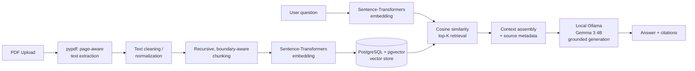

# Architecture

## Pipeline overview

## Components

- **Embedding model** (`app/rag/embeddings.py`): a Sentence-Transformers model
  (`EMBEDDING_MODEL`, default `sentence-transformers/all-MiniLM-L6-v2`)
  converts both document chunks and user queries into fixed-size vector
  representations, so semantic similarity can be computed between them.
- **Vector database**: PostgreSQL + the pgvector extension stores chunk
  embeddings alongside chunk/document metadata and performs the
  nearest-neighbor search directly in SQL (`ORDER BY embedding <=> query`).
- **Retrieval**: for each question, the system retrieves the top-K most
  semantically relevant chunks (`TOP_K`, `MAX_CONTEXT_CHUNKS`), each carrying
  its filename, page number, and similarity score.
- **Generation**: a local Ollama instance running `gemma3:4b` (`LLM_PROVIDER`,
  `OLLAMA_BASE_URL`, `OLLAMA_MODEL`) receives the user's question plus the
  retrieved context, under a system prompt that forbids outside knowledge,
  and produces the grounded answer. See `app/rag/llm/` for the provider
  abstraction and `app/rag/generator.py` for prompt assembly.

## Request flow

1. **Upload** (`POST /documents/upload`): file is validated (type, size), saved to
   disk under a per-document UUID directory, and synchronously ingested.
2. **Ingestion** (`app/rag/pipeline.py`): extract → clean → chunk → embed →
   persist chunks with embeddings in Postgres. Document status becomes
   `indexed` or `failed`.
3. **Query** (`POST /query`): the question is embedded with the same model
   used for chunks, pgvector performs a cosine-distance nearest-neighbor
   search (`ORDER BY embedding <=> query LIMIT K`), and the top-K chunks
   (optionally restricted to one document) are returned with similarity
   scores.
4. **Generation** (`app/rag/generator.py`): retrieved chunks are assembled
   into a numbered context block and sent to the local Ollama LLM
   (`app/rag/llm/ollama_provider.py`) with a system prompt that forbids
   outside knowledge and requires an explicit "not found in the uploaded
   documents" response when the context is insufficient. The uploaded
   document is never sent to the model in full — only the retrieved chunks.
5. **Response**: the API returns the answer, a `grounded` flag, and the
   source chunks (filename, page, similarity score) so the frontend can
   render citations the user can inspect.

## Why these components

| Decision | Rationale |
|---|---|
| Chunk **per page**, not per document | Keeps every chunk's page-number citation exact; the tradeoff is an occasional paragraph split across a page boundary. |
| Recursive character splitter (paragraph → sentence → word → char) | Standard, well-understood strategy that respects natural text boundaries instead of cutting mid-sentence; configurable size/overlap via env vars. |
| `sentence-transformers/all-MiniLM-L6-v2` | Small (~90MB), fast on CPU, strong general-purpose semantic similarity for its size — appropriate for a web app without a GPU-backed embedding service. |
| PostgreSQL + pgvector | A real, production-capable vector database with exact/approximate cosine search, ACID guarantees for document/chunk metadata, and a straightforward path to a managed instance (Supabase, RDS, etc.) at deploy time. |
| Synchronous ingestion (no job queue) | Keeps the stack to two services (API + Postgres) for a project of this scope; the ingestion pipeline is already isolated behind `process_document()` so moving it to a background worker later is a contained change. |
| Local Ollama (`gemma3:4b`) for generation | Grounded system prompt + explicit refusal instruction is the core anti-hallucination mechanism, independent of which model executes it; the LLM is behind an `LLMProvider` interface (`app/rag/llm/`) so the model/provider is a config change (`LLM_PROVIDER`, `OLLAMA_MODEL`), not a rewrite. |

## Why local Ollama instead of a hosted API

- **No external API dependency during development** — no quota limits, rate
  limits, or per-call cost while iterating on chunking, retrieval, or prompt
  design.
- **Privacy** — uploaded documents and their content never leave the
  developer's machine; nothing is sent to a third-party inference API.
- **Reproducibility** — a pinned local model version behaves identically
  across runs and machines, without depending on an external provider's
  model updates or deprecations.
- **Low-cost setup** — a single one-time model download (`ollama pull
  gemma3:4b`, ~3.3GB) replaces a paid API key for local development and
  evaluation.

**Trade-offs (honest, not hidden):**

- **CPU-only inference is slower than GPU or cloud inference.** On a 16GB
  RAM, no-GPU laptop, a single answer generation typically takes several
  seconds to tens of seconds depending on context length and answer length —
  noticeably slower than a hosted API call. `LLM_MAX_TOKENS` and
  `LLM_TIMEOUT_SECONDS` are kept conservative for this reason, and the
  frontend shows a loading state while generation is in progress.
- **A 4B-parameter local model has lower reasoning/generation quality than a
  large hosted model.** It is more prone to imperfect instruction-following
  (e.g. an LLM-judge prompt requiring strict JSON output) and to weaker
  multi-hop reasoning across chunks than a frontier hosted model would be.
  This is a deliberate scope/cost trade-off for local development, not an
  oversight — see `evaluation/results/` for measured generation-quality
  numbers against this specific model.
- The `LLMProvider` abstraction means a hosted provider could be added back
  as an alternative for production deployment without touching the
  retrieval pipeline, if higher generation quality were needed there.
